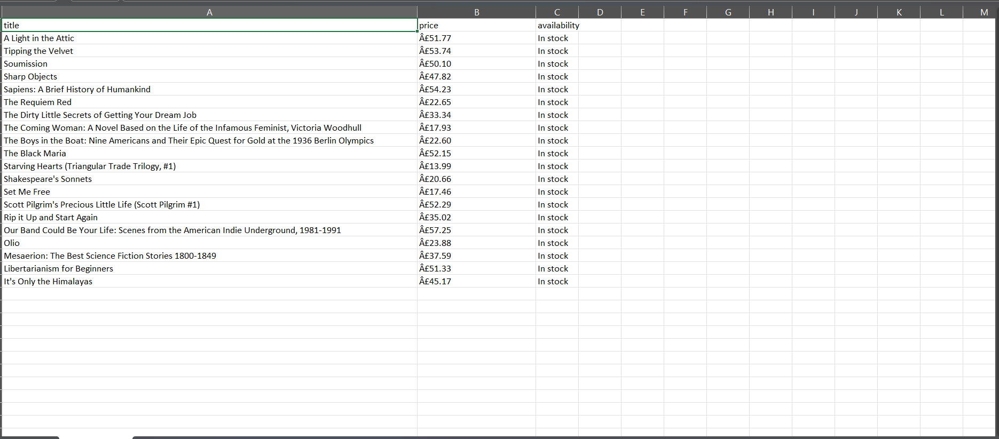

# 📚 Web Scraping Project

A simple, educational web scraping project that demonstrates how to extract data from websites using Python. This project scrapes book information from "Books to Scrape" - a practice website designed for web scraping learning.

## ✨ Features

- **Dual Implementation**: Both Jupyter notebook (.ipynb) and Python script (.py) versions
- **Modular Design**: Clean, reusable code structure
- **Data Export**: Export scraped data to CSV format
- **Error Handling**: Robust error handling and logging
- **Polite Scraping**: Respectful scraping with delays between requests
- **Educational Focus**: Well-documented code with comments

## Tech Stack
 
  requests==2.31.0
  beautifulsoup4==4.12.2
  pandas==2.0.3
  jupyter==1.0.0
  lxml==4.9.3
  python-dotenv==1.0.0

## 📁 Project Structure
 
    CodeAlpha_WebScraping/
│
├── 📄 requirements.txt # Python dependencies
├── 📄 README.md # This documentation file
├── 📓 scraping_project.ipynb # Jupyter notebook (interactive)
├── 🐍 scraper.py # Main Python script
├── ⚙️ config.py # Configuration settings (optional)
├── 📊 books_data.csv # Sample output (generated)

📊 Output
    
    

🤝 Contributing
Contributions are welcome! Here's how you can help:

Report Bugs

Open an issue with detailed description

Include error messages and screenshots

Suggest Features

Describe the new feature

Explain why it would be useful

Submit Pull Requests

Fork the repository

Create a feature branch

Submit a PR with description

📝 License
This project is licensed under the MIT License - see the LICENSE file for details.

⚠️ Disclaimer
Important: This project is for educational purposes only.

Always check a website's robots.txt file before scraping

Review the website's Terms of Service

Don't overload servers with rapid requests

Respect copyright and data ownership

The example uses books.toscrape.com which is specifically for practice

Happy Scraping! 🕷️✨

If you find this project helpful, please give it a ⭐ on GitHub!